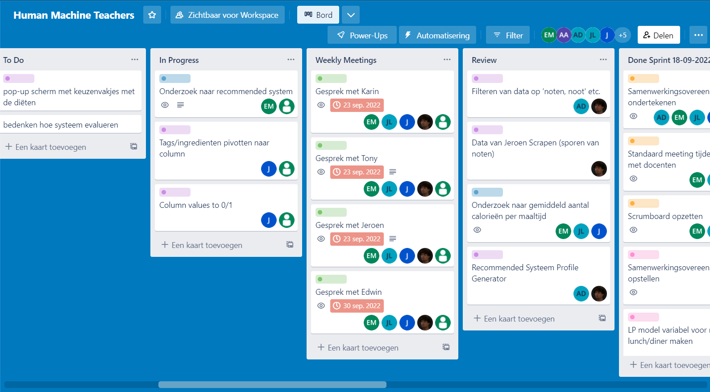
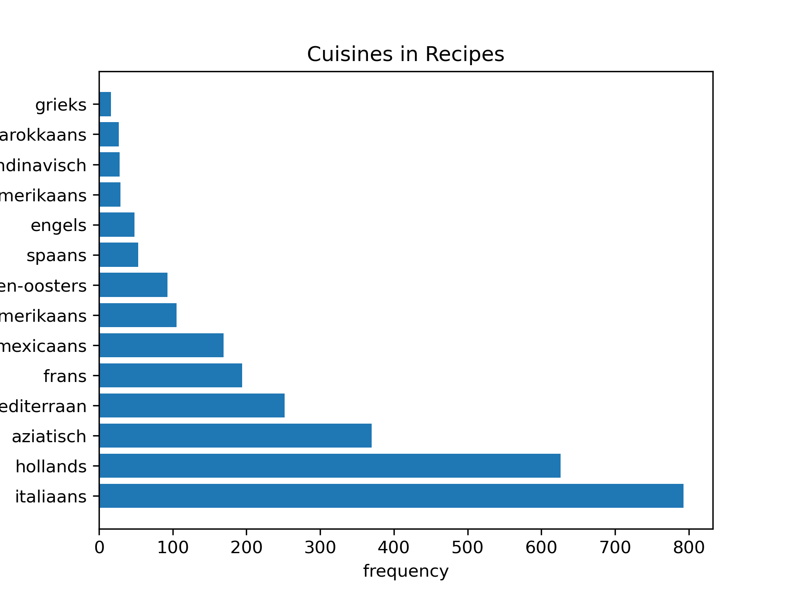

# APD-Minor-Portfolio---Eric-Maat  
Studentnumber: 20162928  
Education: Applied Mathematics  
# <a id="table-of-contents"></a>Table of Contents <!-- omit in toc --> 
- [DataCamp Courses](#DataCamp-Courses)
- [Research Projects](#Research-Projects)
  - [Food Boost](#Food-Boost)
  - [Cofano Containers](#Cofano-Containers)
- [Predictive Analytics](#Predictive-Analytics)
  - [Model Selection](#Model-Selection)
  - [Model Configuration](#Model-Configuration)
  - [Model Training](#Model-Training)
  - [Model Evaluation](#Model-Evaluation)
  - [Model Visualization](#Model-Visualization)
- [Domain Knowledge](#Domain-Knowledge)
  - [Subject Field Introduction](#Subject-Field-Introduction)
  - [Literature Research](#Literature-Research)
- [Data Preprocessing](#Data-Preprocessing)
  - [Data Exploration](#Data-Exploration)
  - [Data Cleansing](#Data-Cleansing)
  - [Data Preparation](#Data-Preparation)
  - [Data Explanation](#Data-Explanation)
  - [Data Visualization](#Data-Visualization)
- [Communication](#Communication)
  - [Presentations](#Presentations)
  - [Writing Paper](#Writing-Paper)
- [Python Notebooks](#Python-Notebooks)
- [Experiments](#Experiments)
- [Other Achievements](#Other-Achievements)

# DataCamp Courses


# Research Projects
## Food Boost
### Task Definition
The first project I worked on was in regards of the Food Boost case. The case focuses on eating more sustainable and healthy dishes and people's personal preferences towards such recipes. In this case it is possible to apply multiple methods. For example, Data Science could be used to predict wether a person likes a certain recipe or not, statistics could be used to estimate which ingredients a person likes or findig optimal combinations of recipes with the use of linear programming.  

Our group of six (which we called "The Human Machine Teachers") tried to set a research goal where we could use multiple methods. We decided on the following research goal:  

**"What method(s) can be used to create a week schedule consisting of lunch and diner recipes while taking calorie intake and nut allergy into account?"**  
_"**1.** Which ingredients make a recipe be considered a nut allergen?"_  
_"**2.** What is a healthy amount of calories for one lunch and one dinner?"_  
_"**3.** What method(s) can be used to predict wether a person likes a recipe or not?"_  
_"**4.** What method(s) can be used to make a varying week schedule of lunches and diners?"_  

The week schedule mentioned here consists of 14 recipes (7 lunches and 7 diners). For this research we limited the schedule to only provide lunch and diner recipes, because only these two types of recipes were both relevant and provide sufficient data.  

We chose a research goal with this many elements and restrictions, because there are many steps and methods needed to reach the end goal. This requires us to delve into different areas of knowledge, which helps us get familiar with multiple methods and data processes. Using only lunch and diner recipes which contain no nuts requires data preparation. To predict wether a person likes certain recipes or not we can make great use of Data Science. To create an optimal recipe schedule we could make great use of linear programming.

### Future Works

Even though the project would eventually last only six weeks, a lot of progress was made regarding the data preprocessing, predictive analysis and Operational Research. Naturally, there is still room for improvement.  

The original data consisted of approximately 10.000 recipes. Around 4.500 of those were kept by only keeping the nut-free lunch and diner recipes. While these are still enough data elements to base a predictive model on, there might still have been too many features. Only the ingredients were kept that were used for at least one percent of the recipes. That ended up being more than 100 features, which might have led to overfitting in the end. Having more data and/or less features would have probably improved the model performances.  

We based our models on the food opinions of a group mate. He ended up liking 180 of the 265 recipes. This meant our created data had 180 ones and 85 zeros, thus making the dataset skewed. We could have balanced the dataset to give both classes equal proportions.  

Linear programming was used for creating the week schedule by having restrictions based on the energy of each chosen recipe. In the future we could involve nutritients besides energy, like fat or protein. This would add more restrictions to the model, but make for a more balanced recipe schedule.

### Conclusions
_**"1. Which ingredients make a recipe be considered a nut allergen?"**_  

To answer this question we searched for a way to determine if a specific ingredient contained nuts or not. Instead of using going by every ingredient in the dataset, we created a list of strings where if an ingredient of a recipe contained one of these strings, the recipe itself would be considered as a nut allergen.

<details>
<summary> List of forbidden nut strings </summary>

```
notenLijst = ["noot","pinda","eikel","amandel","cashew","hazelno","hican","hickory","kemirie","macadamia","nangaino","parano","pecan","pistache","kastanje","walnoot","betelno","beukenno"]
```

</details>

For this we also had to keep in account eventual false positives. For example, "nootmuskaat" contains the string "noot", but this ingredient does not make a recipe a nut allergen. For these cases a list was created of strings that surpass the previous checklist.

<details>
<summary> List of false positives </summary>

```
falsePositives = ["muskaat"]
```

</details>

_**"2. What is a healthy amount of calories for one lunch and one dinner?"**_  

After my teammates had done there research on this topic, they came to the conclusion that a healthy amount of one lunch and one dinner together is 1040 Kcal. This answer would help make the restrictions for the linear programming model.  

_**"3. What method(s) can be used to predict wether a person likes a recipe or not?"**_  

After following the DataCamp courses and having some lectures about machine learning, we concluded that a classifier would work best to answer this question. We chose three classifiers and after tuning the hyperparameters we wrote down the resulting scores of each of them.  

<details><summary> Model performances </summary>

| Classifier Models   | Precision | Recall | Accuracy |
| ------------------- |:---------:|:------:|:--------:|
| Decision Tree       | 0.83      | 0.88   | 0.74     |
| Logistic Regression | 0.83      | 0.71   | 0.66     |
| K-Nearest Neighbors | 0.78      | 0.60   | 0.55     |

</details>

The classification models with the highest precision seem to be the Decision Tree and Logistic Regression. To determine which one is best suited we will also look at the accuracy of the models. The Decison Tree classifier performs better in this regard, which means it is the best method to use for classifying recipes.  

_**"4. What method(s) can be used to make a varying week schedule of lunches and diners?"**_  

A Linear Programming model was used to create the schedule. After the chosen classifier created a list of liked recipes, the LP model would choose 7 lunches and 7 diners and create a week schedule. The restrictions this model followed were:  
* A recipe can only appear in the week schedule once
* Exactly one lunch each day
* Exactly one diner each day
* The maximum amount of calories per day is 1040

The model tries to maximize the amount of calories for each day. By having the last restriction it will never exceed 1040 Kcal, but will try to get as high as possible.

### Planning

For the six weeks we spent on the FoodBoost project we planned to have three group meetings every week. On Monday, Wednesday and Friday. These meetings would involve anything regarding both individual and shared tasks, team co-operation, short-term planning, deadlines, etc. We also held work sessions on days without either lectures or meetings. These were on Tuesday and Thursday where we would make time to work on the project for at least five hours a day.

We have also set up a Trello Board where we would add multiple tasks, big or small, and distribute these over the team. At the meetings we would discuss what is on the board and would add tasks when necessary. The goal of this method was to have a task for everyone at the end of every meeting. The majority of these tasks had deadlines to ensure that people wouldn't stick to just having one task for a longer period of time.

<details>
<summary>Trello board FoodBoost screenshot</summary>

</details>

## Cofano Containers
### Task Definition

The second project I worked on was in regards of the Cofano Case. This case focuses on the transport of containers from the yard of a terminal to a container ship and vice versa. This transport on the terminal will be handled by a reach stacker. Cofano wants to know what methods could be used to fix the container stacking problem where the end goal is to minimize the cost and delay of the whole proces. There is need for a method that organizes the container stacks on the yard in such a way that minimizes the amount of moves it takes to get certain containers to the ship. This problem can be formulated as an optimization problem where heuristics can be applied to solve it.

Our first research goal covered too much of the main problem to solve it in fourteen weeks, so we agreed on the following research goal:

**"What method(s) can be used to solve the ship to container yard part of the container stacking problem using only a reach stacker?"**  
_"**1.** What method(s)/heuristic(s) have been used to solve the container stacking problem in the past?"_  
_"**2.** What defines a move?"_  
_"**3.** What are the restrictions?"_  
_"**4.** What type of containers are transported?"_  
_"**5.** What is the lay-out of the yard?"_  
_"**6.** How can we simulate container ship data?"_  

Question 1 will introduce us to the most used methods for this problem and how to apply those step by step. Questions 2 to 5 are needed to define the context and environment of the situation that we want to optimize. It is important here to keep in mind that we can only use one reach stacker. Question 6 will use the answers on the previous questions to provide the data we can use in conjunction with the chosen method.

### Future Works

We have worked on this project for twelve weeks and achieved a lot in that time. However, our research only covered a part of Cofano's container stacking problem. This means there is still room for future work and improvements.  

The methods and models we applied were all used on a yard that was always empty at the beginning of an episode. In reality, the yard always contains some containers, so we could have tried to apply our model on a yard that is already partially filled with containers at the beginning of every episode. We could make a selection of containers that is randomly placed at the start of each episode to see how the model would (try to) adapt to this situation.  

During the project, our goal was to have the model fill the whole yard with containers until there is no space left. In reality, not all the space in a yard is used up when unloading just one ship. We could have used more yard space or smaller ships to unload to have the model try to find optimal stacks that do not use up all the avaible space on a yard.

The orginized stacks that our models end up with are optimal as long as the ships the containers are loaded in all arrive on schedule. If the order of incoming ships changes or one ship decides to go to another terminal, the lay-out on the yard would probably be much less optimal. In the future we could have the model adapt to such unforeseen situations by training it to produce multiple optimal lay-outs, each for a different order of ships.

Having the least amount of boxed in containers in the yard lay-out is our top priority, but our model doesn't take into account the time it takes for the reach stacker to go from a container it just placed to the next. In the future we could try to focus more on these limitations to prevent eventual delay. This could be done by starting the lay-out of half of the containers at one side of the yard before placing the other half of the load on the other side.

### Conclusions

_**"1. What method(s)/heuristic(s) have been used to solve the container stacking problem in the past?"**_  

I have found several articles on heuristic methods. Some used there own version on a Linear Programming method, others used a certain "GRASP algorithm" to tackle the problem. All of those were methods that could be applied with the big amount of constraints the container stacking problem introduced. After a while, we found out that reinforcement learning was a popular approach for these kind of problems. We delved deeper into what this method was about and then decided we wanted to use this for our final model.  

_**"2. What defines a move?"**_  

We defined a "move" as placing a container from the ship onto the container yard on the terminal. We decided not to take time into account for this.  

_**"3. What are the restrictions?"**_   

<details>
<summary>A container can not be placed on a space where a previous container is placed</summary>

</details>

<details>
<summary>A container can not be placed on a space where there is no ground or other container beneath it</summary>

</details>

<details>
<summary>A container can not be placed on top of a stack that has already reached its max height</summary>

</details>

<details>
<summary>A container can not be placed outside of the container yard</summary>

</details>

<details>
<summary>A container can not be placed between two existing stacks</summary>

</details>

_**"4. What type of containers are transported?"**_  

To not overcomplicate things and make the problem too complex, we decided that every container has the same size and weight. The only thing that can distinguish containers is which ship they will eventually be loaded in.  

_**"5. What is the lay-out of the yard?"**_  

We decided to have a customizable yard that is always empty at the beginning of a game. For the final product we have a container yard of 4x4x5 spaces. This translates to a space for exactly 80 containers.  

_**"6. How can we simulate container ship data?"**_  

To simulate a ship full of containers that have to be transported we created a list of random numbers between 1 and 3 (container with 1 has the highest priority and 3 has the lowest). There were as many numbers in this list as there are spaces on the yard. The order of these numbers was random each episode.

### Planning

For the twelve weeks we spent on the Cofano container case, we kept the schedule we used for the weeks we spent on the FoodBoost case with some slight adjustments. Halfway through this time period we dropped the meeting on wednesday, because at that time there were less to discuss. The wednesday became a work session day instead.  

There was also planned to put more focus on the individual work of each teammate. We planned to have two weeks where each one of us worked separately on their own Reinforcement Learning model. This way, every teammate had to put work into the project and our individual contributions could be used to improve the final model.  

We also created a new Trello Board for this project. The structure mostly stayed the same compared to the one used for the FoodBoost project, but this time we assigned people to certain categories. This meant that each teammate was responsible for the tasks of their assigned category. This way everyone could fullfil at least one roll in the project.  

<details>
<summary>Trello board Cofano screenshot</summary>

</details>

# Predictive Analytics
## FoodBoost
### Models

To predict a person's opinion on thousands of recipes we needed to use Machine Learning. There are too many recipes to do this manually after all. We decided that a person had only two options when rating a recipe. They either liked the recipe (represented by a '1') or did not like the recipe (represented by a '0'). This meant that we were dealing with classes and had to use a classification model.  

Because we try to predict what class a recipe belongs to, this class was made the target variable. The ingredients of a recipe almost always decide wether a person likes a recipe or not, so the ingredients were the the features in this case.  

After doing my assignments on DataCamp, there were, in my opinion, two courses that seemed useful for this case. The courses "Machine Learning with scikit-learn" and "Model Validation in Python" presented several examples of classification models and how to validate these. The three classifiers that stood out here were the **K-Nearest Neighbors**, **Logistic Regression** and **Decision Tree** classifiers.  

After the models were chosen and the data both prepared and splitted into train and test sets, I created and fitted my three own classifier models. The predictions of my models showed the following results.  

<details><summary> Model performances </summary>

| Classifier Models   | Precision | Recall   | Accuracy |
| ------------------- |:---------:|:--------:|:--------:|
| K-Nearest Neighbors | 0.794872  | 0.738095 | 0.641509 |
| Logistic Regression | 0.807692  | 1.000000 | 0.811321 |
| Decision Tree       | 0.848485  | 0.666667 | 0.641509 |

</details>

<details>
<summary>Confusion Matrix: K-Nearest Neighbors</summary>

</details>

<details>
<summary>Confusion Matrix: Logistic Regression</summary>

</details>

<details>
<summary>Confusion Matrix: Decision Tree</summary>

</details>

To determine which classifier was best suited for our research, we would choose the one with the highest precision score. If our final model would predict incorrectly that a recipe is not liked, it has no major consequences for our recipe schedule. But if it predicts incorrectly that a recipe is liked, then the schedule might feature recipes the person doesn't like. This leads me to believe the main focus is on reducing the False Positives, which means a higher precision is more desired. In that case the Decision Tree seems to be the best choice.  

### Hyperparameter tuning

In order to achieve the highest precision for every classifier, I used hyperparameter tuning on all three models.  

#### K-Nearest Neighbors

For the K-Nearest Neighbors classifier I tuned the `n_neighbors` parameter to see what is the optimal amount of neighbors. The following graph shows the average precision score for 1 to 40 neighbors. Based on the results I used `n_neighbors = 28` for the model  

<details>
<summary>Hyperparameter Tuning: n_neighbors</summary>

</details>

#### Logistic Regression

For the Logistic Regression classifier I tuned the `C` and `penalty` parameters using `GridSearchCV` which resulted in the following output. Based on this outcome I went with `penalty = 'l2'` and `C = 0.1`  

```
{'C': 1e-05, 'penalty': 'l2'}
```

#### Decision Tree

For the Decision Tree I decided to tune the `max_depth` parameter to see the best maximum depth of the tree. The following graph shows the average precision score for 1 to 50 tree depth. Based on the results I went with `max_depth = 33` for the final model.  

<details>
<summary>Hyperparameter Tuning: max_depth</summary>

</details>

### Cross-Validation

To check if the models do not under- or overfit I used cross-validation. Here I used stratified cross-validation, because the data was unbalanced and I needed to give the five folds the same proportion of 0 and 1 values.  

<details><summary> Cross-Validation Scores </summary>

| Classifier Models   | Average cross_val_score |
| ------------------- |:-----------------------:|
| K-Nearest Neighbors | 0.688762                |
| Logistic Regression | 0.672980                |
| Decision Tree       | 0.672980                |

</details>

___

The code for the operations of this chapter are in [this python notebook](/Python%20Notebooks/Classification%20models%20Foodboost.ipynb).  

## Cofano Containers

We focused on the unloading part of the Container Storage Problem. Because this problem does not have one clear solution and we didn't know how to implement the Cofano data given to us, we would use neither Supervised nor Unsupervised learning. After hearing one of our mentors talking about it, we decided to use Reinforcement Learning. A literature review about [applications of Machine Learning methods in port operations](https://doi.org/10.1016/j.tre.2022.102722) mentioned this method as well and how much potential it has for these kind of problems.  

Reinforcement learning follows the cycle of trial and error. The agent performs an action on the environment and the environment returns what the consequences of those actions are (state) and the reward the agent gets for it. I tried to apply this to our research problem. 

### The Environment

I used the [Gym library](https://gymnasium.farama.org/api/env/) and their environments to help me understand how to make a suitable environment class. The starting environment I used was a three-dimensional array filled with zeros to simulate an empty container yard.   

<details><summary> An empty 3x3x2 container yard </summary>

```
(array([[['0', '0'],
         ['0', '0'],
         ['0', '0']],
         
        [['0', '0'],
         ['0', '0'],
         ['0', '0']],
         
        [['0', '0'],
         ['0', '0'],
         ['0', '0']]], dtype='<U1')
```

</details>

I included a step and reset method. The step method would use the given action to put a container (1, 2 or 3) in the environment and would return the observation, reward and wether the game is done or not. A game would end when either the yard is full, no container can be added to the current lay-out, or the ship has no containers left to unload. In one of these cases the environment would be reset for the next game.

### The Agent

The agent would be able to use the whole yard as action space at all times. For a 3x3x2 sized yard, that would mean the agent would have an action size of 18 at any time in the game. A container placement had to follow the restrictions, so when an impossible action is chosen (like placing a container in the air) the container would not be placed and the agent would receive a negative reward. To train the agent I intended to use Deep Q-learning. I tried using a neural network with two hidden layers of size 64 in case one layer was not sufficient. I also used a replay buffer to save samples which the agent could use to train.  

The code for my Reinforcement Learning model is in [this python notebook](/Python%20Notebooks/Reinforcement%20Learning%20model%20Eric.ipynb).

___

### Evaluating an end lay-out

My own Reinforcement Learning model ended up not working as intended, so I shared all the knowledge I gained to at least be of some use for the final product. We ended up using Martti's Reinforcement Learning model which had an action space based on the lay-out rows instead of all avaible spaces. This model would use a yardsize of 4x4x5.

To evaluate how optimal the produced end lay-outs of this model were, I build a reward function. Any container in a row can be reached from two sides. The function would choose the best side to approach each container and would rate the lay-out on how many containers required other containers to be relocated. The less containers that require relocation, the higher the score.  

<details>
<summary>Reach container from two sides</summary>

</details>

<details>
<summary>Reinforcement Learning model vs Random choice performance</summary>

</details>

The barplot above shows the performance of the Reinforcement Learning model compared to a randomly filled lay-out according to my reward function. Both methods generated 13 lay-outs each. The averages of the results are shown here. In this case we only look at the amount of containers that require relocations. The model outperforms the random choice with only having around 13 boxed in containers out of all 80 in the lay-out.

___

The code for my inbox/reward function is in [this python notebook](/Python%20Notebooks/Reward%20Inbox%20function.ipynb).

# Domain Knowledge

## Subject Field Introduction
Our research focused heavily on predicting wether a person likes a recipe or not. In this field, it is most important to reduce predictions which classify a recipe as 'liked', while in reality the person disliked the recipe (In our case, False Positives). Though it is also favorable to reduce prediction errors that fall into the False Negative category (especially if the person is a picky eater), such errors do not necessarily affect a good recipe schedule. It is worse to have disliked recipes show up on the schedule than missing out on some recipes that the person might have liked.  

## Literature Research

# Data Preprocessing
## FoodBoost

For the FoodBoost case we received four datasets. These were from Allerhande and contained data on nearly 10.000 recipes. For the final classifiers models I used the `recipes.csv` as a base DataFrame and to have the calorie amounts of each recipe (The nutrients dataset has the calories too, but having the unit 'kcal' at the end makes it a column of strings instead of integers). I used the `ingredients.csv` to display the ingredients each recipe has and make these the features of the predictive model. These were also useful to determine wether a recipe is nut-free or not. I also used the `tags.csv` to determine if a recipe is lunch, diner or something else.  

### Calorie Data Research

The research of my teammates showed the desired amount of calories for one lunch + one diner is around 1040 kcal. To know how many of the lunch + diner combinations there were around this calorie amount I decided to analyse the data. After I cleansed the data to only have lunch and diner recipes, I created two boxplots to show the distributions of calories for both dish types.  

<details>
<summary>Calorie Distribution Boxplots for both lunch and diner</summary>

</details>

The lunch boxplot shows some outliers far above the upper fence of 845 kcal. Closer inspection of these datapoints show that these are recipes which are not meant to be eaten in one sitting by one person. These are recipes for food like whole loafs of bread, peanut butter and strawberry jam. These will be removed for further analysis. Logically, no lunch is below the lower fence of -75 kcal. From this analysis I decided to only use lunches between 0 and 845 kcal going forward.  

The diner boxplot shows less extreme outliers than the lunch boxplot. Some outliers above the upper fence of 1005 kcal may include dishes meant for multiple people and below the lower fence of 165 kcal there may be some recipes that are not meant to only be a part of a whole diner. From this, I decided to only use diners between 165 and 1005 kcal for any follow-up research.  

All the selected lunches were combined with all the selected diners to create total calorie amounts of all possible day menus. These ended up being around 3.25 million different combinations. This distribution is shown in the next histogram.  

<details>
<summary>Lunch+Diner calorie total Histogram</summary>

</details>

The plot shows that a lot of lunch+diner combinations add up to be between 900 and 1100 kcal. This would mean there are enough different day menus possible to create a recipe week schedule with some variation.  

The code for this research can be found in [this python notebook](/Python%20Notebooks/Statistics%20Calorie%20Data.ipynb).

### Other Data Operations

Though I did not end up using it for my final classifier models, the `nutrients.csv` and other data was still used to examine if there was any data in it that I could use for these models.  

At one moment in the project I thought about using the nutrients of each recipe as features to predict wether a person liked a recipe or not. Perhaps a high amount of protein or fat could be significant for someone's opinion on the dish. I converted the string values of the nutrients data to floats to create a usable DataFrame. In the end, I did not use the data for any promising models. Calories was the only data we would use for our final product.  

I also saw potential in using the different cuisines (like Dutch, Asian or Italian recipes) as features. The tags data showed for some recipes to which cuisine it belongs after all. The difference in cuisine could also prove to be a factor for someone's food opinions. French dishes differ alot from Asian dishes for example. After inspecting all different tags a recipe could have I created a list of cuisine tags.  

<details>
<summary> List of cuisine tags </summary>

```
keukens = ['amerikaans','aziatisch','chinees','engels','frans','grieks','hollands','indiaas','indonesisch','italiaans', 'japans','marokkaans','mediterraan', 'mexicaans', 'midden-oosters','scandinavisch','spaans','thais','zuid-amerikaans']
```

</details>

If a recipe contained one of these tags it would be used for the analysis. I created a horizontal barplot to show the amount of recipes each cuisine has in the (already cleansed) data.

<details>
<summary>Amount of recipes belonging to a cuisine</summary>

</details>

The Italian cuisine seems to have the most recipes with the Dutch one not far behind. That means the model would probably have an easier time predicting wether a person likes one of these cuisines or not. I ended up not doing any follow-up research with this data because of time restraints.

The code for these data operations can be found in [this python notebook](/Python%20Notebooks/FoodBoost%20Data%20Operations.ipynb).

## Cofano Containers

For the Cofano case we received seven datasets. These were about the lay-out of the container yard, the avaible machines and the transport of containers of Cofano. This data was not as straightforward as the FoodBoost data and contained some confusing terms. To better understand theses datasets Joanne and I analyzed all seven of them. While Joanne examined what data could be useful to us, I examined how all the DataFrames could connect to one another. I ended up with the following information.

<details>
<summary>Connections between DataFrames</summary>

</details>

Every row in this table contains the attributes that connect with one another. At least, I think these are the correct connections. I wrote down all the different "id" attributes and connected them on which attribute names match and the range of their values. The attributes of `stackentry.csv` and `handling.csv` seem to make it possible to connect every attribute with each other. Though, the value ranges suggest that these attributes are more interconnected than what my table shows.  

I also wanted to visualize the container lay-out of the yard. There was not much data on the exact posion of the containers. The only DataFrame that seemed useful for this purpose was `stacks.csv`. Using the `positionx`, `positiony`, `maxlength` and `rotation` attributes I was able to create some sort of topdown view of the stacks on the yard. Though it may not be the correct way to display this data, I used a scatterplot to visualize these stacks.  

<details>
<summary>Topdown view of Stacks</summary>

</details>

# Communication

## Presentations

## Writing Paper

# Python Notebooks

[Dit is een notebook](/Python%20Notebooks/Score%20Functie%20Ding.ipynb)

# Experiments

# Other Achievements
